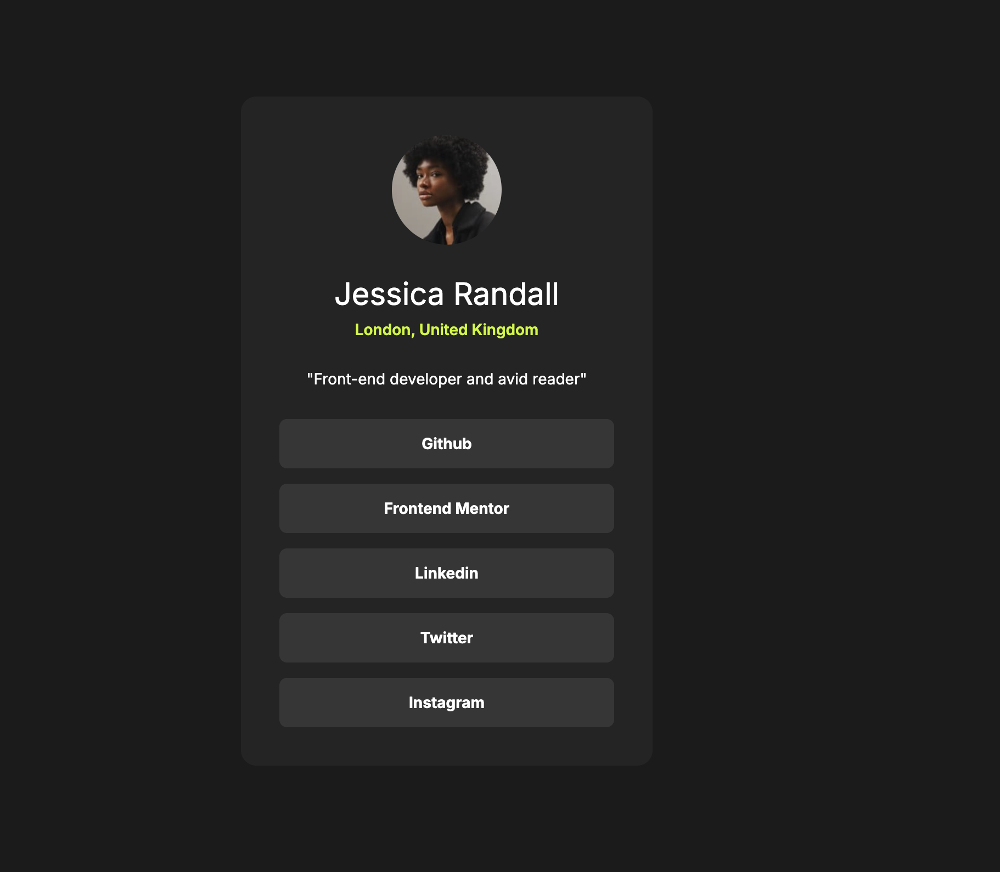

# Frontend Mentor - Solution du composant QR code

Voici une solution au [challenge QR code component sur Frontend Mentor](https://www.frontendmentor.io/challenges/social-links-profile-UG32l9m6dQ). Les challenges Frontend Mentor vous permettent d'améliorer vos compétences en programmation en réalisant des projets réalistes.

## Aperçu

### Capture d'écran

### Liens

- URL de la solution sur GitHub : https://github.com/isamu64/social-links-profile
- URL du site en ligne : https://isamu64.github.io/social-links-profile/
- URL du challenge : https://www.frontendmentor.io/challenges/social-links-profile-UG32l9m6dQ

## Mon processus

### Description du challenge

Crée une carte de présentation pour les réseaux sociaux.

### Technologies utilisées

- Balisage HTML5 sémantique
- Propriétés personnalisées CSS
- Flexbox pour centrer la carte

### Ce que j'ai appris

Ce challenge c'est bien passé, aucune grosse difficulté particulière. Quelques précisions sur les width, max-width, border-box et conten-box qui m'ont fait du bien pour ma compréhension globale.

### Développement continu

Je veux continuer à utilisé massivement HTML, CSS, Flexbox et bien d'autres choses comme Grid ou Javascript par la suite.
Apprendre Figma ainsi que l'UX/UI.

### Ressources utiles

- [Doc Flexbox](https://css-tricks.com/snippets/css/a-guide-to-flexbox/) — Cette ressource m'a aidé pour l'utilisation de flexbox. J'ai particulièrement apprécié cette méthode et je compte continuer à l'utiliser.
- [MDN](https://developer.mozilla.org/fr/) - Site indispensable pour comprendre HTML et CSS. Coupler avec l'IA pour encore plus éclaircir les notions qui peuvent être parfois difficile à comprendre juste en lisant ce site.

### Collaboration avec l'IA

J'ai utilisé Chat GPT pour m'aiguiller lorsque j'étais bloqué. Il me fournis des indices petit a petit.

## Auteur

- Frontend Mentor - [@isamu64](https://www.frontendmentor.io/profile/isamu64)
